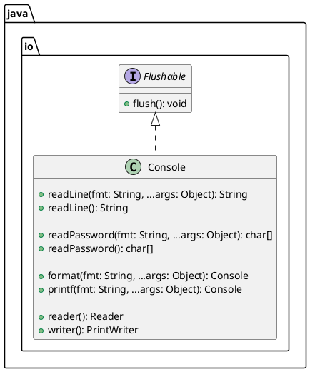
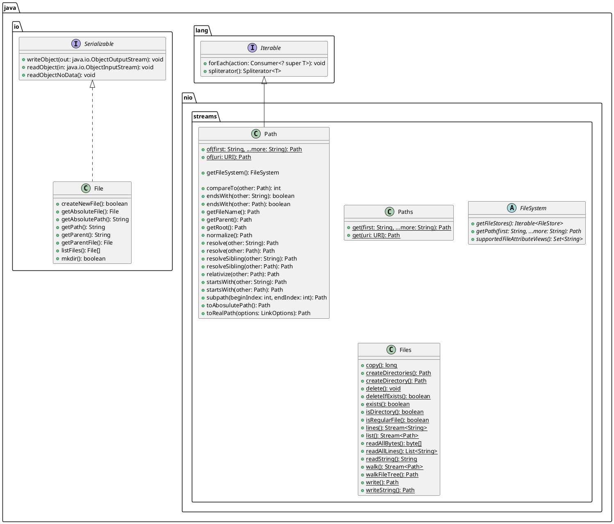

# Help Guide

This help guide on any topic related to the current subject

The JDK tools and their commands enable developers to handle development tasks such as compiling and running a
program, packaging source files into a Java Archive (JAR) streams, applying security policies to a JAR streams, and more.

The Util Commands topic lists and describes the most used Java Development Kit (JDK) commands and his arguments.
They’re grouped into the following sections based on the related functions that they perform. Details about the
used commands can be found inside the [tools guide](./TOOLS.md).

---

# 1. Introduction

Java provides many classes to support the function of reading data in and exporting data from an application.

**Input** sources can be input from the command line, console or a streams.

**Output** sources can be output to the command line, console or a streams.

Java reads and writes data to and from files using one of several streams types:

- **Byte streams**: Byte streams are used for the most primitive I/O. All streams are descended from `InputStream`
  and `OutputStream`. The streams I/O byte streams are `FileInputStream` and `FileOutputStream`
- **Character streams**: Automatically adapt to the local character set and have support for internationalization.
  All character streams classes are descended from `Reader` and `Writer`
- **Data streams**: Allow to write data primitives and Strings in Java
- **Object streams**: Allow to serialize (or write an object) in Java, and all of its current state to a streams. An
  object can be serialized if it implements the `Serializable` or `Externalizable` interface
    - `transient` modifier: Specify that field will not be part of the persistent state of an object serialization
    - To allow subtypes of non-serializable access to be serialized, the subtype may assume responsibility for saving
      and restoring the state of the supertype's public, protected and package fields. A public no-args constructor
      must be accesible to the subclass that is serializable to initialize the super class's state, if not, an error
      will be detected at runtime. If parent implements `Serialization`, subtype not need a public no-args constructor
- **Buffered streams**: Used for reading and writing chunks of data, not directly to and from the streams system but
  to a memory area called the buffer. Reduce expensive operations such as disk access and network activity.
  **Flushing** the buffer simply means writing out a buffer at critical points, without waiting for it to fill.
  Not all BufferedOutput support auto flush. There are four buffered streams classes used to wrap the  
  unbuffered streams:
    - `BufferedInputStream` and `BufferedOutputStream` create the buffered byte streams
    - `BufferedReader` and `BufferedWriter` create buffered character streams

---

# 2. Console

## 2.1. Standard streams

You are by now more than familiar with the standard input and output streams represented by `System.out` and
`System.in`

`System.out` is the "standard" output streams (`java.io.PrintStream`), which is already open and ready to accept
output data. This streams is used to display output to and output destination specified by the host environment or
user. For historical reasons, this is a byte streams. `System.err` is another standard output streams

`System.in` is the "standard" input streams (`java.io.InputStream`), which is already open and ready to supply input
data. Corresponds to keyboard input or another input source specified by the host environment or user. For
historical reasons, this is a byte streams

## 2.2. Since Java 6

`System.console` (`java.io.Console`) was introduced by Java 6, as a preferred alternative, to provide methods to
access the character-based console device, if any, associated with the current Java Virtual machine

---

# 3. Serialization

## 3.1. Summary

| Feature                                                 | `Serializable`                                                   | `Externalizable` |
|---------------------------------------------------------|------------------------------------------------------------------|------------------|
| By default, all non-static + non-transient will persist | TRUE. Supertype's attributes will persist if is Serializable too | FALSE            |
| Public no args constructor required                     | FALSE. Required if super type does not implement Serializable    | TRUE             |
| Overriding readObject and writeObject customize         | TRUE                                                             | FALSE            |
| Overriding readExternal and writeExternal customize     | FALSE                                                            | TRUE             |

# 4. Paths

## 4.1 Class Diagram

# Additional sites

- [Readme](./README.md): Advisory document about this project.
- [Tools](./TOOLS.md): A set of tools and commands reference topic lists and describes the
  Java Development Kit (JDK) tools
- [License](./LICENSE): License about this project

# Websites

- [Java SE Language Specification](https://docs.oracle.com/javase/specs/jls/se11/html/index.html): _The Java
  Virtual Machine Specification_, Java SE 11 Edition
- [Java API Specification](https://docs.oracle.com/en/java/javase/11/docs/api/index.html): _Java® Platform, Standard
  Edition & Java Development Kit_, Version 11 API Specification
