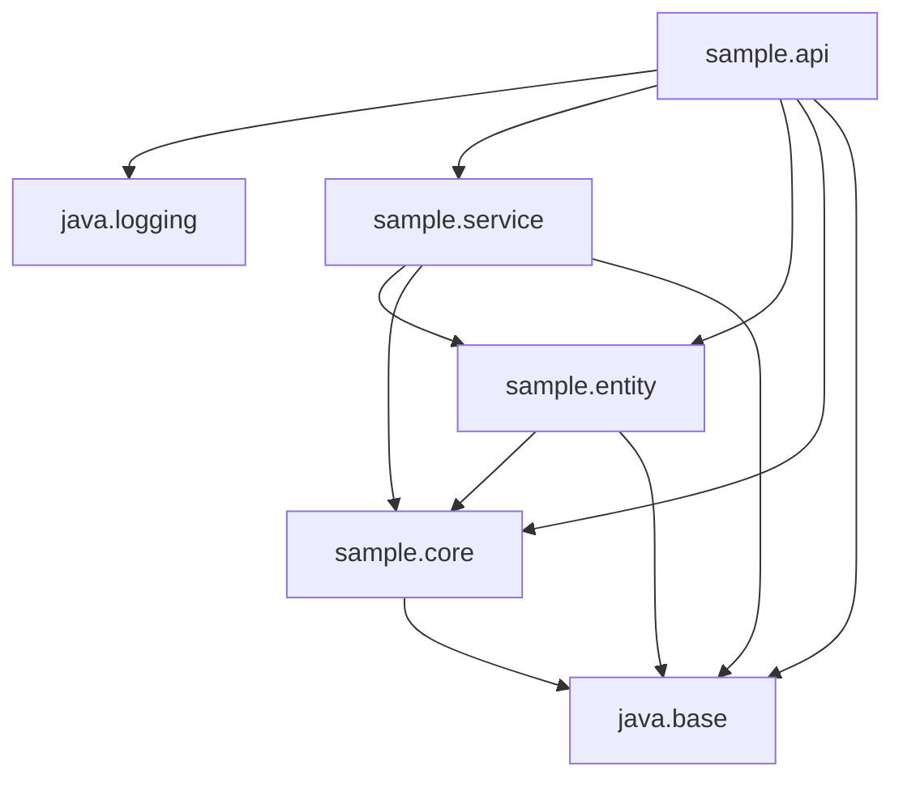

# Help Guide

This help guide on any topic related to the current subject

The JDK tools and their commands enable developers to handle development tasks such as compiling and running a 
program, packaging source files into a Java Archive (JAR) file, applying security policies to a JAR file, and more.

The Util Commands topic lists and describes the most used Java Development Kit (JDK) commands and his arguments. 
They’re grouped  into the following sections based on the related functions that they perform. Details about the
used commands can be found inside the [tools guide](./TOOLS.md).

## 1. Compilation

---

Compile a module: 
- `-d <directory>`: Specify where to place generated class files
- `--module-source-path <module source path>`: Specify where to find input source files 
for multiple modules
- `[-m | --module] <module>`: A comma-separated list of modules to compile
  on the operation

```shell
# Will compile all projects, because app dependes on all projects (core and utils)
javac -d out/production --module-source-path=./*/src/ -m advanced.module.app
```

> 📘 Info
>
> If you take a look on **advanced.module.utils**/_base.sample.interfaces.Countable.class_, you will see that not contain 
> any relationship with packages of **advanced.module.core**, because here is using static values of these packages.
> 
> Also, is transpiled to text, and we could execute without specify **advanced.module.core** module on class-path or 
> module-path

## 2. Build Java Archives (JAR)

---

Creation of a new Java Archive (JAR) from modular compiled files:
  - `[-c | --create]`: Specify we want to create a JAR
  - `[-f | --file] <filename.jar>`: The archive file name. When omitted, either stdin or stdout is used based on the 
    operation
  - `[-e | --main-class] <mainclass>`: The application entry point for stand-alone applications bundled into a 
    modular, or executable, jar archive
  - `-C <directory>`: Change to the specified directory

```shell
jar -c -f out/app.jar -p out/production -e org.app.entity.BaseEntity -C out/production/advanced.module.app/ .
jar -c -f out/utils.jar -p out/production -e base.sample.interfaces.Countable -C out/production/advanced.module.utils/ .
```

## 3. Run applications

---

Run app, where is passed with a classpath (expecting a list of directories, JAR archives, and ZIP archives)

```shell
# Should return same thing
java -cp out/production/advanced.module.utils base.sample.interfaces.Countable
java -cp out/utils.jar base.sample.interfaces.Countable
```

---

A separated list of directories, each directory is a directory of modules that replace upgradeable modules in the 
runtime image

```shell
java -p out/production -m advanced.module.app/org.app.entity.BaseEntity
```

> 📘 Info
>
> Previous runnable commands can be use with the additional command `--dry-run`, which loads main class but doest 
> not run it. Used for testing module dependencies are satisfied. A successful result is no output

## 4. Info about applications

---

List observable modules

```shell
java -p out/production --list-modules
```

---

List of packages that contain that module

```shell
java -p out/app.jar:out/utils.jar --describe-module advanced.module.app
java -p out/production/ --describe-module advanced.module.app
```

---

Print the module descriptor, or automatic module name

```shell
jar -f out/app.jar --describe-module
```

---

List the table of content of a jar archive

```shell
jar --file out/app.jar -t
```

## 5. Info about dependencies

---

Print dependency summary only

```shell
jdeps -s out/production/advanced.module.core
```

---

Print all class level dependencies

```shell
jdeps -v out/production/advanced.module.core
```

---

Lists the module dependencies. It also prints any internal API packages if referenced. This options transitively
analyzes libraries on class path and module path if referenced

```shell
jdeps --list-deps --module-path out/production out/production/advanced.module.app
```

---

Same as `--list-deps` with not listing the implied reads edges from the module graph

```shell
jdeps --list-reduced-deps --module-path out/production -m  advanced.module.app
```

---

Same as `--list-reduced-deps` with printing a comma-separated list of modules dependencies


```shell
jdeps --print-module-deps --module-path out/production -m advanced.module.app
```

---

Analyze the module dependencies. It prints the module descriptor,
the resulting module dependencies after analysis and the graph after transition reduction. It also identifies
any unused qualified exports

```shell
jdeps --module-path out/production -m advanced.module.app
```

---

> 📘 Note
>
> `jdeps` not contain the option `-p` as other commands (`java`, `javac`, `jar`) because here the options
refer to package (`-p` | `-package` | `--package`). Still, it contains the `--module-option`, which works same as other
commands

## 6. Migration to a Modular Application

#### Problem Specification

We have the following structure:

```
.
├── src
│   ├── sample
│   │   ├── api
│   │   │
│   │   ├── core
│   │   │
│   │   ├── entity
│   │   │
│   │   ├── service
├── .gitignore
├── LICENSE
└── README.md
```

We want to migrate to a relationship between modules like this:



---
#### Creation of JAR from class path

1. Create a manifest file `META-INF/MANIFEST.MF` with the Class-Path and the Main-Class defined
   ```manifest 
   Main-Class: sample.api.Controller
   Class-Path: sample.core.jar sample.entity.jar sample.service.jar
   ```
2. Jar-up those files
    ```shell
    jar -Mcf sample.core.jar -C out/production sample/core
    jar -Mcf sample.entity.jar -C out/production sample/entity
    jar -Mcf sample.service.jar -C out/production sample/service
    jar -mcf META-INF/MANIFEST.MF sample.api.jar -C out/production sample/api
    ```

3. Execute API through `JAR`
    ```shell
    java -jar sample.api.jar
    ```

---
#### Migration Bottom-Up Approach
Migrate the least dependent module to the most dependent. Uses both the `--class-path` for existing `JARs` and 
`--module-path` for modularized `JARs`. You may need to include --add-modules when executing in this hybrid way.

```shell
# Creation of a jar least dependent module without manifest file
jar -Mcf sample.core.jar -C out/production/sample.core/ .
# Used when you non-modular code depends on artifacts on the module path
java -p . --add-modules sample.core -jar sample.api.jar
```

---
#### Migration Top-Down Approach
Migrate from the most dependent module to the least dependent. Uses the `--module-path` only and loads existing 
`JARs` as automatic modules if they are not modularized

```shell
# Creation of a jar most dependent module
jar -mcf META-INF/MANIFEST.MF sample.api.jar -C out/production/sample.api/ .
# Used when you non-modular code depends on artifacts on the module path
java -p . -m sample.api/sample.api.Controller
```

---
#### Determine problems
Not all existing jar files can be used as an automatic module. The `jdeps` tool should be used to try to identify 
these exceptions:
- **Illegal Access To Internal APIs**: Only `java.*` and `javax.*` packages are fully supported. Most `com.sun.*` and `sun.*` 
  packages, on the other hand, are internal and hence inaccessible by default
    ```shell
    # Get additional information about jdk internal problems
    jdeps --jdk-internals dom4j-1.6.1.jar
    # Get additional information about jdk internal problems
    jdeprscan dom4j-1.6.1.jar
    ```
- **Split Packages**
    ```shell
    # Example of Split Package problem
    jdeps -s genorimo-jta_1.1_spec-1.1.1.jar
    ```
- **Cyclical dependencies**

# Additional sites
- [Readme](./README.md): Advisory document about this project.
- [Tools](./TOOLS.md): A set of tools and commands reference topic lists and describes the
  Java Development Kit (JDK) tools
- [License](./LICENSE): License about this project
# Websites
- [Java SE Language Specification](https://docs.oracle.com/javase/specs/jls/se11/html/index.html): _The Java
  Virtual Machine Specification_, Java SE 11 Edition
- [Java API Specification](https://docs.oracle.com/en/java/javase/11/docs/api/index.html): _Java® Platform, Standard
  Edition & Java Development Kit_, Version 11 API Specification
